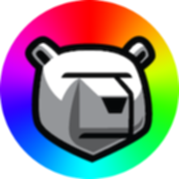

# Color Demo Example and Training Content



* [Introduction](#introduction)
* [Usage](#usage)
* [Feature in Videos](#feature-in-videos)
* [Operating Color Demo](#operating-color-demo)
* [Which DRP Endpoint Are You Talking To?](#which-drp-endpoint-are-you-talking-to)
* [NOTES](#notes)
  + [Not All Content Types Represented](#not-all-content-types-represented)
  + [Other Content Examples](#other-content-examples)
  + [Bundle Operation Errors](#bundle-operation-errors)
  + [README.md as Documentation Meta Info](#readme-as-documentation-meta-info)
  + [Talk to Us!](#talk-to-us)


## Introduction

For [Digital Rebar Provision](http://rebar.digital), which is maintained by
[RackN](https://rackn.com).

This `colordemo` repo is an example / training content pack designed to help
new users of [Digital Rebar Provision](http://rebar.digital) to understand how
content packs can be authored and maintained in a Git (or other Source Code
Control System) management system.

The directory structure (in the "`content/`" directory) closely relates to the
different parts of composable content that are represented in Content Bundles
(or Packs).  Each directory contains unique content pieces for each of the
types of content.

Directories that don't exist here (for example "`bootenvs`") can be created if
you need to build content of that type.

All Workflow elements in Content are executed as a "`job`" on the Machine side.
This is why you must have a Runner (agent) running.  DRP supports "`plugins`"
which are compiled binaries, that execute on the DRP Endpoint side, on behalf
of the Machine.  This Color Demo content does NOT relate to Plugins, only
content executed on the Machine as Workflow jobs.


## Usage

To install the `colordemo` content pack, use the following command:

```shell
git clone https://github.com/digitalrebar/colordemo.git
cd ./content
drpcli contents bundle ../colordemo-v1.yaml
```

To inject/install it to a Digital Rebar Provision endpoint, use:

```shell
drpcli contents create ../colordemo-v1.yaml
```

If you make changes to the local files (updates, edits, fixes, etc), and
want to update the already installed conent pack, rebundle the changes,
then update as follows:

```shell
# edit files as desired
drpcli contents bundle ../colordemo-v2.yaml
drpcli contents update colordemo ../colordemo-v2.yaml
```


## Feature in Videos!

* Creating Content: https://youtu.be/79Y-3IOguZk
* Bundling: https://youtu.be/JUyzFNkLyZU


## Operating Color Demo

You must have a machine that is currently running an Agent (`runner-service`);
the _Sledgehammer_ (discovery) bootenv meets this criteria, or the
`runner-service` has been run on an installed OS.  Verify the agent is running
with `ps -ef | grep 'drpcli processjobs' | grep -v grep"`.

Add the `colordemo-example` profile to the machine; a cloned version of the
profile with your changes to the _Params_, or the bare params directly to
the machine.

Set the machine to the `colordemo` _Workflow_.  The "**i**" (information) column
should change to the set color and icon.  To rerun the workflow, you must
first clear the workflow (remove) the current `colordemo` workflow, then
re-set it on the machine.


## Which DRP Endpoint are you talking to?

Remember that the `drpcli` client tool by default connects to the address
and port specified as follows:

  `https://127.0.0.1:8092`

Make sure you set the Endpoint (and Username/Password if changed from defaults)
with the appropriate options.  Run `drpcli` by itself to get help output.


## Notes


### Not All Content Types Represented

Digital Rebar Provision content has many parts and pieces.  There are several
types of content that are not represented in the Color Demo.  Empty directories
are not allowed in Git repos, so we can't provide blank directories for your
reference.  DRP `bundle` operations can't deal with errant files in a directory
structure (like "`.gitempty`").

For content types not represented here (for example "`bootenvs`"), simply create
an empty directory of that name, to create content of that type.  Use some of
the examples from other content packs (see [Other Content Examples](#other-content-examples)
for more inspiration.


### Other Content Examples

We at [RackN](https://rackn.com) regularly "crib" or "borrow" from existing
content examples we've created already.  You can too!  To check out a much more
advanced use of a Git repo to host multiple content packs, see:

  * https://github.com/digitalrebar/provision-content

Note that the "`content/`" directory contains the actual "**DRP Community Content**",
bundle, while other content packs exist in the subdirectories "`krib`", 
"`sledgehammer-builder`", etc.


### Bundle Operation Errors

The contents bundle operation is very sensitve to errant/unexpected files
in the directory structure.  Anything that is NOT a meta file (eg a file
with `.\_Something.meta` or a YAML file will be misinterpreted and an
error will occur on the bundle operation, like:

```shell
drp@pixie:./colordemo$ drpcli contents bundle colordemo-v1.yaml
Error: Failed to load: No idea how to decode LICENSE into dr-provision-releases
```

(`.gitignore` will also similarly cause an error).  Make sure your directory
is clean from errant hidden/dot files, things like `LICENSE`, `README.md`, etc.

For this reason, the `colordemo` contents have been moved in to the subdirectory
named `content/`.


### README as Documentation Meta Info

This README is included (by symbolic reference) as `content/.\_Documentation.meta`
file.  The Documentation meta file can use RST formatted text.


### Talk to Us!

The [RackN Team](https://rackn.com) uses Slack to communicate with our
[Digital Rebar Provision](http://rebar.digital) community. If you haven't already
signed up for our Community Slack, you can do so at:

  * https://rackn.com/support/slack/

We look forward to helping you with your provisioning automation journey towards
a fully self sustained Continuously Delivered Data Center journey.


